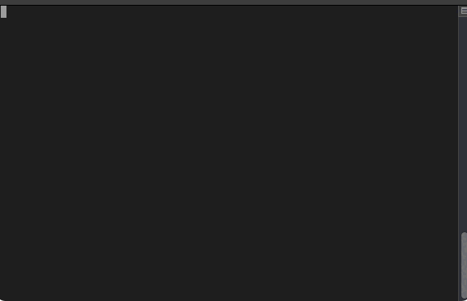

# Teaching Python Post-production CLI

This program is an experiment to see if we can use 
Python to automate our post-production steps.

We are setting this up as a series of command-line programs, 
but eventually want to turn this into an automated pipeline of tasks.
## Current Features
- Dolby.io Client
    - Audio Enhancement
    - Audio and Speech Analysis
    - Job status polling
- AssemblyAI transcription
    - Speaker labeling
    - Word boosting
    - Job status polling
- Local transcoding using ffmpeg to mp3 format
    - requires [ffmpeg](http://ffmpeg.org/) on the local machine
    - allows intro and outro music to be added
## Planned Features
- S3-compatible storage
- Webhook callbacks to avoid job status polling

## Example

## Installation
Note: This project uses poetry and assumes you have it installed. [Directions](https://python-poetry.org/docs/#installation)

1. Clone or download the project from the repository
1. `poetry install`
1. `poetry run tppp INPUTFILE`

## Usage

```
$ tppp enhance input.mp3

$ tppp transcode input.mp3 --intro-music intro.mp3 --outro-music outro.mp3

$ tppp transcribe input.mp3
```

## Process

### Workflow Steps

1. Merge multiple recording channels into single WAV file
1. Enhance audio using Dolby.io
1. Transcribe audio using Assembly AI
    1. Include filler words for automatic removal from audio
    1. Include chapter markers for MP3
    1. 
## Configuration
### Dolby.io API key
This project requires a [Dolby.io](https://dolby.io/) API key. You can get one for free from [here](https://dolby.io/signup). As of July 2021, they are offering 200 free minutes of media processing per month.

You can set your API key as an environment variable ('DOLBY_API_KEY') or in a .env file at the root of the project.
### AssemblyAI API key
This project requires an [AssemblyAI](https://app.assembly.ai) API key. You can get one for free from [here](https://app.assemblyai.com/login/). As of July 2021, they are offering the first 5 hours of transcription for free.

You can set your API key as an environment variable ('DOLBY_API_KEY') or in a .env file at the root of the project.